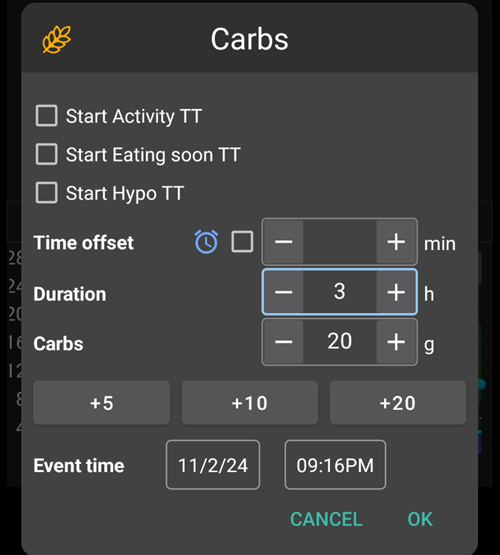
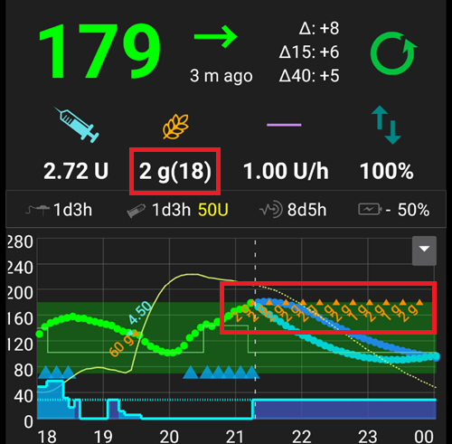

(Extended-Carbs-extended-carbs-ecarbs)=
# Extended carbs / "eCarbs"

## What are eCarbs and when are they useful?

Avec une thérapie par pompe régulière, Les bolus étendus sont un bon moyen de traiter les repas gras ou absorbés lentement et dont l'impact sur l'augmentation de la glycémie est plus long que la durée d'action de l'insuline. Cependant dans un contexte de boucle, les bolus étendus n'ont pas autant d'intérêt (et posent des difficultés techniques) car il s'agit d'un débit de basal fixe élevé, qui va à l'encontre du fonctionnement de la boucle, qui ajuste dynamiquement le débit de basal. For details see [extended bolus](#extended-bolus-and-why-they-wont-work-in-closed-loop-environment) below.

Mais le besoin de prendre en charge de tels repas existe toujours. Which is why AAPS as of version 2.0 supports so called extended carbs or eCarbs.

Les eGlucides sont des glucides qui sont actifs pendant plusieurs heures. Pour les repas standard avec plus de glucides que de graisse/protéines, entrer les glucides à l'avance (et réduire le bolus initial si nécessaire) est généralement suffisant pour éviter d'injecter trop tôt de l'insuline.  Mais pour les repas à absorption plus lente où l'entrée de la totalité des glucides au début entraîne trop d'IA injectée par les SMB, les eGlucides peuvent être utilisés pour simuler plus précisément comment les glucides (et tous les équivalents de glucides que vous entrez pour les autres macronutriments) sont absorbés et influencent la glycémie. Grâce à cette information, la boucle peut gérer les glucides en administrant les SMB de façon plus progressive, ce qui peut être assimilé à un bolus prolongé dynamique (cela devrait également fonctionner sans les SMB, mais probablement moins efficacement).

**Note:** eCarbs aren't limited to fatty / protein heavy meals: they can be also be used to help in any situation where there are influences that increase the blood sugar, e.g. other medication like corticosteroids.

## Mechanics of using eCarbs

To enter eCarbs, set a duration in the *Carbs* dialog on the overview tab, the total carbs and optionally a time shift (*numbers below are just examples, you will need to try your own values to arrive at satisfactory glucose response for your use-cases*):

The eCarbs on the overview tab, note the carbs in brackets at the COB field, which shows the carbs in the future:

Les glucides qui se seront pris en compte plus tard sont en orange foncé dans l'onglet Traitement :

______________________________________________________________________

A way to handle fat and protein with that feature is described here: [https://adriansloop.blogspot.com/2018/04/page-margin-0.html](https://adriansloop.blogspot.com/2018/04/page-margin-0.html)

______________________________________________________________________

## Configuration recommandée, exemple de scénario, et notes importantes

The recommended setup is to use the OpenAPS SMB APS plugin, with SMBs enabled as well as the *Enable SMB with COB* preference being enabled.

A scenario e.g. for a Pizza might be to give a (partial) bolus up front via the *calculator* and then use the *carbs* button to enter the remaining carbs for a duration of 4-6 hours, starting after 1 or 2 hours.

**Important notes:** You'll need to try out and see which concrete values work for you of course. You might also carefully adjust the setting *max minutes of basal to limit SMB to* to make the algorithm more or less aggressive. Avec des repas faibles en glucides et riches en graisses/protéines, il peut être suffisant d'utiliser uniquement des eGlucides sans bolus manuels (voir le blog ci-dessus). Lorsque des eGlucides sont générés, une note Careportal est également créée pour pouvoir documenter toutes les entrées, et faciliter les itérations et l'amélioration des entrées.

(Extended-Carbs-extended-bolus-and-why-they-wont-work-in-closed-loop-environment)=
## Bolus étendu et pourquoi ils ne fonctionneront pas dans une boucle fermée ?

Comme mentionné ci-dessus, les bolus étendus ou mixtes ne fonctionnent pas vraiment dans un environnement en boucle fermée. [See below](#why-extended-boluses-wont-work-in-a-closed-loop-environment) for details

(Extended-Carbs-extended-bolus-and-switch-to-open-loop-dana-and-insight-pump-only)=
### Bolus étendus et passage en boucle ouverte - uniquement pour les pompesDana et Insight

Certaines personnes ont demandé une option pour utiliser des bolus étendus dans AAPS, car ils voulaient traiter les aliments spéciaux comme ils avaient l'habitude de le faire.

C'est pourquoi à partir de la version 2.6, il y a une option pour un bolus étendu pour les utilisateurs de pompes Dana et Insight.

- La boucle fermée sera automatiquement arrêtée et basculera en mode boucle ouverte pour la durée du bolus étendu.
- La quantité d'insuline, le temps restant et le temps total seront affichés sur la page d'accueil.
- On Insight pump extended bolus is *not available* if [TBR emulation](../CompatiblePumps/Accu-Chek-Insight-Pump.md#settings-in-aaps) is used.

(Extended-Carbs-why-extended-boluses-won-t-work-in-a-closed-loop-environment)=
### Pourquoi les bolus étendus ne marchent pas avec une boucle fermée

1. La boucle détermine que maintenant 1,55 U / h doit être délivré. Que ce soit administré sous forme de bolus étendu ou de DBT n'a pas d'importance pour l'algorithme. En fait, certaines des pompes utilisent le bolus étendu. Que devrait-il arriver alors ? Most pump drivers then stop the extended bolus -> You didn't even need to start it.

2. Si vous aviez le bolus étendu en entrée, que devrait-il se passer dans le modèle?

   1. Doit-il être considéré comme neutre avec le débit de Basal et faire la boucle dessus ? Ensuite, la boucle devrait également être en mesure de réduire le bolus si, par exemple, vous devenez trop bas et que toute l'insuline "neutre" est éliminée ?
   2. Faut-il simplement ajouter le bolus étendus ? Donc, la boucle devrait simplement être autorisée à continuer ? Même dans la pire des hypo ? Je ne pense pas que ce soit si bon : une hypo est prévue, mais il ne faut pas l'empêcher ?

3. L'IA que le bolus étendu accumule est prise en compte après 5 minutes lors du prochain calcul. En conséquence, la boucle donnerait moins de basal. So not much changes... except that the possibility of hypo avoidance is taken.
