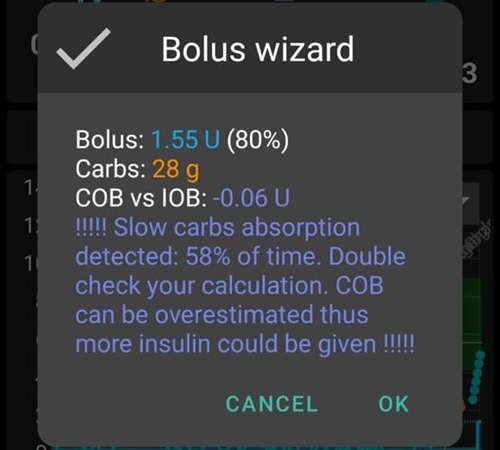

# Troubleshooting

Vous pouvez trouver des informations de dépannage sur de nombreuses pages dans le wiki. Cette page est une collection de liens pour vous aider à trouver les informations nécessaires pour résoudre votre problème.

Additional useful information might also be available in the [FAQ](../UsefulLinks/FAQ.md).

## AAPS app

### Building & updating

* [Lost keystore](TroubleshootingAndroidStudio#lost-keystore)
* [Troubleshooting AndroidStudio](TroubleshootingAndroidStudio)

### Paramètres
* [Profile](Profiles-troubleshooting-profile-errors)

  

* [Pump - data from different pump](../Maintenance/Update3_0.md#failure-message-data-from-different-pump)

  

* [Nightscout Client](../GettingHelp/TroubleshootingNsClient.md)

### Utilisation
* [Wrong carb values](../DailyLifeWithAaps/CobCalculation.md#detection-of-wrong-cob-values)

   

* [SMS commands](../RemoteFeatures/SMSCommands.md#troubleshooting)

### Problèmes de connexion bluetooth fréquents

Cela peut se produire avec diverses pompes. En plus d'exclure AAPS de toute optimisation de batterie, vous pouvez également exclure l'application Bluetooth du système de l'optimisation de la batterie. Cela peut être utile dans certains cas. Selon le téléphone que vous utilisez, vous trouverez l'application bluetooth différemment.

Voici des exemples pour les trouver sur des téléphones Android spécifiques.

#### Téléphones Pixel (Android standard)

* Allez dans les paramètres d'Android, sélectionnez "Applications".

  

* Sélectionnez "Voir toutes les applications"

  

* Dans le menu à droite, sélectionnez "Afficher les applications système".

  

* Maintenant, recherchez et sélectionnez l'application "Bluetooth".

  

* Cliquez sur "Optimisation de la batterie" et sélectionnez "Ne pas optimiser".

  

#### Téléphone Samsung

* Allez dans les paramètres d'Android, sélectionnez "Applications"

* Sur l'icône qui modifie soi-disant l'algorithme de tri (1), sélectionnez "Afficher les applications système" (2).

  

  

* Maintenant, recherchez l'application bluetooth et sélectionnez-la pour voir ses paramètres.

  

* Sélectionnez "batterie".

  

* Réglez le sur "Non optimisé"

  

## MGC

* [General](../CompatibleCgms/GeneralCGMRecommendation.md#troubleshooting)
* [Dexcom G6](../CompatibleCgms/DexcomG6.md#troubleshooting-g6-and-one)
* [Libre 3](../CompatibleCgms/Libre3.md#experiences-and-troubleshooting)
* [Libre 2](../CompatibleCgms/Libre2.md#experiences-and-troubleshooting)
* [xDrip - no CGM data](../CompatibleCgms/xDrip.md#identify-receiver)
* [xDrip - Dexcom troubleshooting](../CompatibleCgms/xDrip.md#troubleshooting-dexcom-g5g6-and-xdrip)

## Pompes

* [DanaRS](../CompatiblePumps/DanaRS-Insulin-Pump.md#dana-rs-specific-errors)
* [Accu-Chek Combo general](../CompatiblePumps/Accu-Chek-Combo-Tips-for-Basic-usage.md)
* [Accu-Chek Combo + Ruffy](../CompatiblePumps/Accu-Chek-Combo-Pump.md#why-pairing-with-the-pump-does-not-work-with-the-app-ruffy)
* [Accu-Chek Insight](../CompatiblePumps/Accu-Chek-Insight-Pump.md#insight-specific-errors)
* [Medtronic + RileyLink](../CompatiblePumps/MedtronicPump.md#what-to-do-if-i-loose-connection-to-rileylink-andor-pump)

## Téléphones

* [Jelly](../CompatiblePhones/Jelly.md)
* [Huawei bluetooth & battery optimization](../CompatiblePhones/Huawei.md)

## Smartwatches

* [Troubleshooting Wear app](../UsefulLinks/WearOsSmartwatch.md#troubleshooting-the-wear-app)
* [Sony Smartwatch 3](../UsefulLinks/SonySW3.md)
