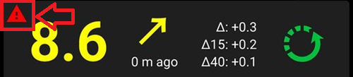
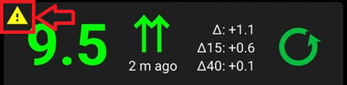

# Vérifications nécessaires après la mise à jour vers AAPS 3.0

* **Minimum Android version is 9.0 now.**
* **Data is not migrated to new database.**

  Ne vous plaignez pas, c'est un changement si énorme qu'il n'était tout simplement pas possible de le faire. Ainsi après la mise à jour de l'IA, GA, traitements, etc seront effacés. You have to create new [profile switch](../DailyLifeWithAaps/ProfileSwitch-ProfilePercentage.md) and start with zero IOB and COB.

  Planifiez la mise à jour avec soin !!! C'est mieux si vous le faites sans insuline et glucides actifs

* Please see the [Release Notes](../Maintenance/ReleaseNotes.md) for details on new and changed features.

## Vérification des automatisations

* De nouvelles restrictions ont été introduites. Vérifiez vos automatisations, en particulier si les conditions d'activation sont toujours valides.
* Si l'une des conditions est manquante, vous devez l'ajouter à nouveau.
* Les automatisations en rouge contiennent des actions invalides, modifiez les et réinitialisez avec des valeurs valides

  Exemple : Un changement de profil à 140% était autorisé avant, mais il est maintenant restreint à 130%.

## Vérification de vos paramètres NSClient et des options de synchronisation

* L'implémentation du plugin NSClient a complètement changé.
* Allez dans l'onglet NSClient et ouvrez les paramètres dans le menu de droite. Une nouvelle option "Synchronisation" est maintenant disponible.
* Vous pouvez maintenant choisir en détail quels éléments seront synchronisés avec votre site Nightscout.

## Profil Nightscout ne peut plus être sélectionné
* Le profil Nightscout est mort, repose en paix!
* Pour copier votre profil Nightscout actuel dans un profil local, allez sur la page Traitements (maintenant accessible dans le menu de droite).
* Recherchez un changement de profil avec 100% et appuyez sur "dupliquer".
* Un nouveau profil local est ajouté, valable à partir de la date actuelle.
* Pour mettre à jour le profil du côté NS, utilisez "Clone" (enregistrement!!, pas profil) et enregistrez les modifications. Vous devriez voir "Profil valide à partir de :" et la date actuelle.

## Réinitialiser le mot de passe principal
* Vous pouvez maintenant réinitialiser votre mot de passe principal au cas où vous l'auriez oublié.
* You need to add a file named `PasswordReset` to the `/AAPS/extra` directory on your phones fileystem.
* Redémarrez AAPS.
* Le nouveau mot de passe sera le numéro de série de votre pompe active.
* Pour Dash: Le numéro de série est toujours 4241.
* Pour EROS, il est également listé dans l'onglet POD dans "Numéro de série"

## Warning signal beneath BG

À partir d'Android 3.0, vous pouvez avoir un signal d'avertissement à côté de votre glycémie sur l'écran principal.

  

  

For details see [AAPS screens page](../DailyLifeWithAaps/AapsScreens.md#bg-warning-sign)

## Message d'échec : Données provenant de pompes différentes

   

To resolve this issue go to [config builder](../SettingUpAaps/ConfigBuilder.md#pump). Sélectionnez la pompe virtuelle puis resélectionnez votre pompe réelle. Cela réinitialisera l'état de la pompe.
